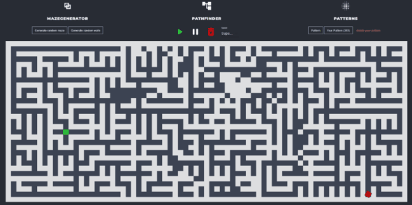
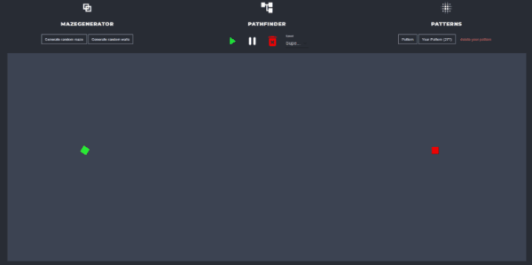

 
 

# Path Finder & Maze Generator

Project designed to visualize pathfinding algoritm (Dijkstra algoritm) and the maze generator.

- create complicated walls patterns
- generate random maze
- find the shortest path to every pattern
- interactive search for a new path after adding a new wall
- set start and end point

## Demo

Here is a website link: https://dnt-path.herokuapp.com/

# Maze Generator

Project implements Prim's algoritm for maze generator

 
 

## Technologies

- app made in ReactJS
- all animations and styling in plain CSS
- algoritms implemented in plain JS

## Getting Started

1. Run `npm install`
2. Go to parent directory and run `npm run start`
3. Open http://localhost:3000 to view it in the browser.

The page will automatically reload if you make changes to the code.
You will see the build errors and lint warnings in the console.
